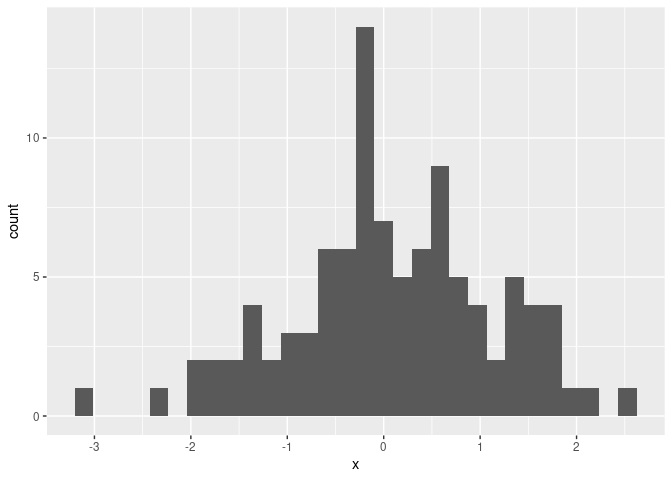
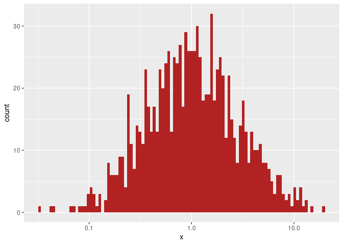

<!-- README.md is generated from README.Rmd. Please edit that file -->

# gghist: Quickly draw a histogram using ggplot2

[](https://cran.r-project.org/package=badger)
[](https://cran.r-project.org/package=badger)
[](https://cran.r-project.org/package=badger)
[](https://cran.r-project.org/package=badger)
[](https://github.com/frederikziebell/gghist/actions)

gghist is a wrapper around ggplot2’s `geom_histogram()` to easily plot a
histogram of a numeric vector. This is especially useful, since
`qplot()` was deprecated in ggplot2 3.4.0.

## Installation

You can install the current release from CRAN via

``` r
install.packages("gghist")
```

or the development version from Github via

``` r
devtools::install_github("frederikziebell/gghist")
```

## Example

``` r
library(gghist)

x <- rnorm(100)
gghist(x)
#> `stat_bin()` using `bins = 30`. Pick better value with `binwidth`.
```



``` r

x <- exp(rnorm(1000))
gghist(x, bins = 100, fill = "firebrick") + 
  scale_x_log10()
```


